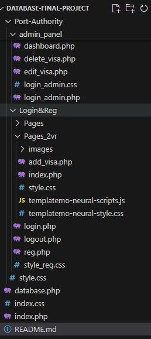

# 🛂 Immigration Management System (Port Authority)

## 📖 Overview
The **Immigration Management System** is a web-based application designed to streamline the visa application and management process.  
It allows:
- Users to submit visa applications online  
- Administrators to approve, reject, or mark applications as pending  
- Real-time data visualization with **Pie** and **Bar Charts** on the admin dashboard  

---

## ⚙️ Tech Stack

| Component | Technology Used |
|------------|------------------|
| Frontend   | HTML, CSS, JavaScript |
| Backend    | PHP |
| Database   | MySQL (via XAMPP) |
| Server     | Apache Web Server (XAMPP) |

---

## 📁 Project Structure
| 🗂️ **Project Folder Structure** | 

## 🧩 Features

### 👤 User Features
- Register and log in securely  
- Submit visa application forms with:
  - Full Name  
  - Passport Number  
  - Visa Type (10+ visa categories)  
- View visa application status:
  - Pending  
  - Approved  
  - Rejected  

### 🔐 Admin Features
- Secure admin login  
- Manage visa records:
  - Add / Edit / Delete visa entries  
- Approve, reject, or mark applications as pending  
- Search applications by:
  - Full Name  
  - Passport Number  
  - Visa Type  
  - Application Status  
- Visual dashboard including:
  - 📊 Pie Chart for visa type distribution  
  - 📈 Bar Chart for visa status overview  

---

## 🗄️ Database Setup

1. Open **XAMPP Control Panel**  
2. Start **Apache** and **MySQL**  
3. Create a new database in **phpMyAdmin** (example: `immigration_db`)  
4. Import your SQL file (if available)  
5. Update your database connection in `database.php`:

   ```php
   <?php
   $conn = mysqli_connect("localhost", "root", "", "immigration_db");
   if (!$conn) {
       die("Connection failed: " . mysqli_connect_error());
   }
   ?>
🌐 Server Configuration
This project runs on Apache Web Server included in XAMPP

You can modify the IP address in Apache’s configuration file if you want to host it on your local or external IP

To change your IP:

Open xampp/apache/conf/httpd.conf

Find this line:

mathematica
Copy code
Listen 80
Replace it with:

php-template
Copy code
Listen <your_ip>:80
Save and restart Apache from the XAMPP Control Panel

## 📊 Data Visualization

The system includes an **interactive admin dashboard** with visual data insights to help administrators easily monitor visa records and trends.

**Built using:**
- JavaScript (Pie Chart & Bar Chart)
- Real-time data fetched from the MySQL database through PHP queries

**Key Insights Displayed:**
- 📅 Visa application trends over time  
- 🧾 Application status distribution (Approved, Pending, Rejected)  
- 🌐 Popular visa categories by type  

---

## 💡 Future Improvements

Planned enhancements and upgrades for the system include:

- 📧 **Email Notifications** — Automatically inform users about visa status updates  
- 🌍 **Multi-language Support** — Allow users to view the site in multiple languages  
- 🧑‍💼 **Role-based Access Control** — Different permissions for admin, staff, and users  
- 📱 **Responsive UI** — Full compatibility with mobile and tablet devices  
- 🔗 **API Integration** — Connect with external immigration or government systems for real-time verification
